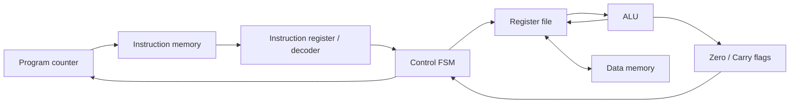

# MiniRISC — Custom 8-bit Processor

**Verilog · SystemVerilog · Python · Yosys · Lattice iCE40 · nextpnr**

A custom multi-cycle processor developed from ISA and RTL design through automated functional verification and FPGA implementation analysis. By Ela Onal.

**V2: 20/20 selected regression tests passed; synthesis and place-and-route completed. No physical FPGA board validation has been performed.**

[Results](#results) · [Architecture](#architecture) · [Verification](#verification-flow) · [Implementation](#implementation-flow) · [Repository map](#repository-map) · [Limitations](#limitations-and-future-work)

## V1 and V2

| Version | Scope | Source |
| --- | --- | --- |
| V1 | Custom ISA, Verilog datapath/control, directed module and CPU tests, Python assembler | [main](https://github.com/elaonal/MiniRISC/tree/main) |
| V2 | SystemVerilog self-checking/reference-model tests, automated regression, FPGA wrapper, synthesis, iCE40 mapping, place-and-route and timing/resource analysis | [v2-development](https://github.com/elaonal/MiniRISC/tree/v2-development) |

The default branch retains V1 source. **Open `v2-development` for the completed V2 implementation.** V1 notes are historical: their synthesis/timing future-work statements do not describe the current V2 status.

## Results

| Check | Committed result | Supporting evidence |
| --- | --- | --- |
| Selected functional regression | **20 PASS, 0 FAIL**: 9 module + 6 CPU/ISA + 4 SystemVerilog + 1 FPGA-wrapper tests | [Verification summary](https://github.com/elaonal/MiniRISC/blob/v2-development/verification/verification_summary.md), [runner](https://github.com/elaonal/MiniRISC/blob/v2-development/scripts/run_regression.sh) |
| Synthesis and routing | Completed for **iCE40HX8K, CT256** | [Implementation summary](https://github.com/elaonal/MiniRISC/blob/v2-development/fpga/reports/implementation_summary.md), [Yosys log](https://github.com/elaonal/MiniRISC/blob/v2-development/fpga/reports/yosys_synthesis.log) |
| Post-route timing | **53.39 MHz estimated Fmax; PASS at 50 MHz** | [nextpnr log](https://github.com/elaonal/MiniRISC/blob/v2-development/fpga/reports/nextpnr_place_route.log) |
| Device utilisation | **4,631/7,680 logic cells (~60%); 1/32 block RAMs** | [nextpnr utilisation](https://github.com/elaonal/MiniRISC/blob/v2-development/fpga/reports/nextpnr_place_route.log) |

The frequency above is the **final post-route** estimate, not the earlier 55.78 MHz estimate in the same log. It is not a measured hardware clock limit. Automatic I/O placement was used without a board-specific PCF.

## Architecture

- 8-bit datapath and program counter; 16-bit instructions; eight 8-bit general-purpose registers.
- Separate 256 × 16-bit instruction memory and 256 × 8-bit data memory.
- ALU and Zero/Carry flags; FSM-controlled `FETCH → DECODE → EXECUTE → WRITEBACK`, with a HALT state until reset.
- Custom ISA for arithmetic, logic, data movement, LOAD/STORE, JMP/JZ, CMP and HALT. **Not RISC-V compatible.**
- V2 integration adds reset synchronisation, LED debug and UART transmission; interfaces are simulated, not board-tested.



Conceptual block relationships; see [ISA and architecture](https://github.com/elaonal/MiniRISC/blob/v2-development/docs/architecture.md), [CPU RTL](https://github.com/elaonal/MiniRISC/blob/v2-development/rtl/minirisc_cpu.v) and [FPGA wrapper](https://github.com/elaonal/MiniRISC/blob/v2-development/fpga/rtl/minirisc_fpga_top.v) for implementation detail.

## Verification flow

Directed module tests → CPU/ISA integration → SystemVerilog ALU checking/reference scoreboard → FPGA-wrapper simulation. The runner compiles with Icarus Verilog, runs each simulation, checks exit status and recognised failure messages, and reports a combined pass/fail count.

[SystemVerilog tests](https://github.com/elaonal/MiniRISC/tree/v2-development/verification/tests) include additional experiments beyond the selected 20-test suite. A 20/20 result is a test pass count, not exhaustive ISA or code coverage. The assembler integration test uses a committed generated program; the final runner does not regenerate it with Python.

## Implementation flow

Verilog CPU and wrapper → **Yosys `synth_ice40`** → JSON netlist → **nextpnr-ice40** packing, placement and routing → ASC output → timing and utilisation reports.

The [implementation script](https://github.com/elaonal/MiniRISC/blob/v2-development/scripts/run_implementation.sh) selects `--hx8k --package ct256 --freq 50 --pcf-allow-unconstrained`. Generic synthesis and structural timing studies are supporting development work; the device-specific routed report above is the evidence for the quoted Fmax.

## Run locally and tools

Install **Icarus Verilog** (`iverilog`, `vvp`) for regression; **Yosys** and **nextpnr-ice40** with iCE40 device support for implementation. Python 3 supports the assembler and program generators. Project IceStorm supports the iCE40 toolchain; Surfer can be used to inspect waveforms.

```bash
git clone https://github.com/elaonal/MiniRISC.git
cd MiniRISC
git switch v2-development
bash scripts/run_regression.sh
bash scripts/run_implementation.sh
```

Run from the repository root so relative memory-file paths resolve. Regression outputs go to `sim/regression/`; implementation regenerates `fpga/build/` and overwrites the synthesis/routing logs in `fpga/reports/`. Tool versions can affect implementation results; consult the committed log headers.

## Repository map

Links below open V2 unless marked V1.

| Location | What to inspect |
| --- | --- |
| [rtl/](https://github.com/elaonal/MiniRISC/tree/v2-development/rtl) | Processor blocks and CPU integration |
| [tb/](https://github.com/elaonal/MiniRISC/tree/v2-development/tb) | Directed module and CPU tests |
| [verification/](https://github.com/elaonal/MiniRISC/tree/v2-development/verification) | SystemVerilog tests, historical logs, generators and summary |
| [scripts/](https://github.com/elaonal/MiniRISC/tree/v2-development/scripts) | Final regression and FPGA implementation entry points |
| [fpga/](https://github.com/elaonal/MiniRISC/tree/v2-development/fpga) | Wrappers, integration test, constraint templates and implementation reports |
| [assembler/](https://github.com/elaonal/MiniRISC/tree/v2-development/assembler) and [programs/](https://github.com/elaonal/MiniRISC/tree/v2-development/programs) | Python assembler, assembly and memory images |
| [synthesis/](https://github.com/elaonal/MiniRISC/tree/v2-development/synthesis), [timing/](https://github.com/elaonal/MiniRISC/tree/v2-development/timing), [optimization/](https://github.com/elaonal/MiniRISC/tree/v2-development/optimization) | Earlier generic synthesis and structural optimisation studies |
| [V1 docs](https://github.com/elaonal/MiniRISC/tree/main/docs) | Original architecture, project notes and verification |

## Limitations and future work

- **No physical FPGA board validation:** no board programming, measured UART/LED behaviour, electrical measurements or hardware Fmax.
- Select a board, supply real clock/pin constraints, generate its bitstream and validate reset, UART and LED behaviour against simulation.
- Expand automated coverage and negative tests; make additional verification experiments part of a clearly scoped regression.
- Investigate memory inference and critical-path optimisation, then compare resource/timing results under the same device constraints.
- Measure board power and external-interface timing when hardware is available.

Completed V2 synthesis, placement/routing and post-route analysis are documented results; physical deployment remains future work.
